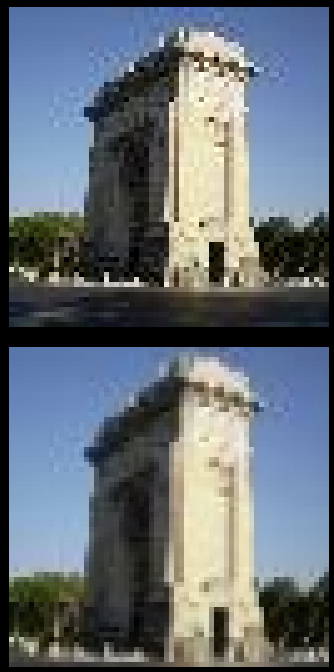
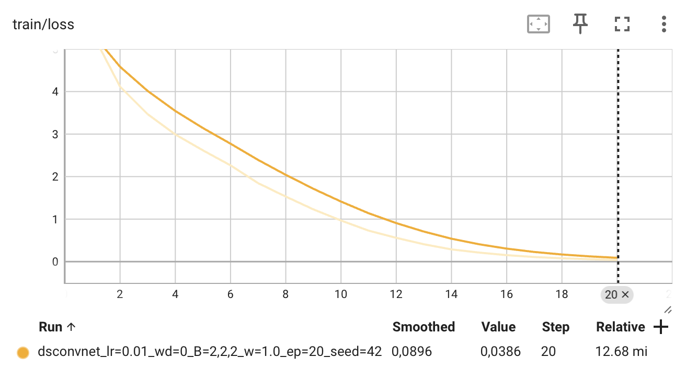
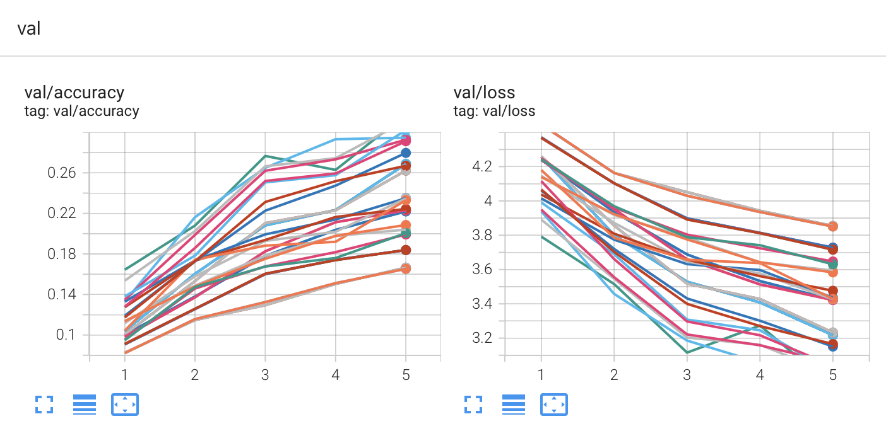
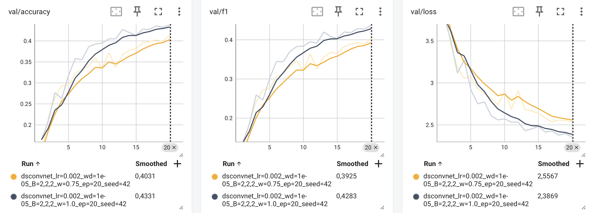

# Rapport de projet — CSC8607 : Introduction au Deep Learning

> **Consignes générales**
> - Tenez-vous au **format** et à l’**ordre** des sections ci-dessous.
> - Intégrez des **captures d’écran TensorBoard** lisibles (loss, métriques, LR finder, comparaisons).
> - Les chemins et noms de fichiers **doivent** correspondre à la structure du dépôt modèle (ex. `runs/`, `artifacts/best.ckpt`, `configs/config.yaml`).
> - Répondez aux questions **numérotées** (D1–D11, M0–M9, etc.) directement dans les sections prévues.

---

## 0) Informations générales

- **Étudiant·e** : _NIAURONIS, Tatiana_
- **Projet** : _Projet 6 (Tiny ImageNet x classification multiclasses)_
- **Dépôt Git** : _https://github.com/tatiana-nrs/csc8607_projects_
- **Environnement** : `python == ...`, `torch == ...`, `cuda == ...`  
- **Commandes utilisées** :
  - Entraînement : `python -m src.train --config configs/config.yaml`
  - LR finder : `python -m src.lr_finder --config configs/config.yaml`
  - Grid search : `python -m src.grid_search --config configs/config.yaml`
  - Évaluation : `python -m src.evaluate --config configs/config.yaml --checkpoint artifacts/best.ckpt`

---

## 1) Données

### 1.1 Description du dataset
- **Source** (lien) : https://huggingface.co/datasets/zh-plus/tiny-imagenet
- **Type d’entrée** (image / texte / audio / séries) : image couleur
- **Tâche** (multiclasses, multi-label, régression) : classification multiclasses 
- **Dimensions d’entrée attendues** (`meta["input_shape"]`) : (3, 64, 64)
- **Nombre de classes** (`meta["num_classes"]`) : 200

**D1.** Quel dataset utilisez-vous ? D’où provient-il et quel est son format (dimensions, type d’entrée) ?

J’utilise le dataset Tiny ImageNet chargé depuis Hugging Face Datasets sous le nom zh-plus/tiny-imagenet. Le dataset contient 100000 images et deucx colonnes. Chaque exemple est une image couleur RGB de 64×64 pixels accompagnée d’un label (par exemple n01443537). On a 200 classes au total.

### 1.2 Splits et statistiques

| Split | #Exemples | Particularités (déséquilibre, longueur moyenne, etc.) |
|------:|----------:|--------------------------------------------------------|
| Train | 90000     |  200 classes, 500 images par classe                    |
| Val   | 10000     |  même 200 classes, 50 images par classe                |
| Test  | 10000     |  pareil, 50 images par classe prélevé  dans le train   |

**D2.** Donnez la taille de chaque split et le nombre de classes.  

Le split d’entraînement contient 100 000 images de base, le split de validation contient 10 000 images et on a 200 classes au total. Après découpe, j’obtiens 90 000 images pour l’entraînement, 10 000 images pour la validation (le split `valid` d’origine) et 10 000 images pour le test que j’ai prélevées dans le train initial. 

**D3.** Si vous avez créé un split (ex. validation), expliquez **comment** (stratification, ratio, seed).

Le dataset fournit déjà un split de validation de 10 000 images, que j’ai conservé tel quel. Comme il n’y avait pas de split de test, j’en ai créé un en prenant un ratio de 0.1 soit 10 000 exemples dans le split `train` d’origine. Le tirage a été fait avec une seed dont la valeur par défaut était de 42 dans le fichier de configuration. Le reste du train (100 000 − 10 000 = 90 000) sert de nouveau split d’entraînement. J'ai utilisé stratify_by_column="label" afin de préserver la même distribution de labels dans train/val/test (450/50/50 par classe) et assurer une évaluation comparable.

**D4.** Donnez la **distribution des classes** (graphique ou tableau) et commentez en 2–3 lignes l’impact potentiel sur l’entraînement.

On obtient:

```
HF train size = 100000
=== NB PAR CLASSE (HF train_test_split, stratify_by_column='label') ===
 cls |  train |    val |   test
--------------------------------
   0 |    450 |     50 |     50
   1 |    450 |     50 |     50
   2 |    450 |     50 |     50
   3 |    450 |     50 |     50
   4 |    450 |     50 |     50
   5 |    450 |     50 |     50
   6 |    450 |     50 |     50
   7 |    450 |     50 |     50
   8 |    450 |     50 |     50
   9 |    450 |     50 |     50
  10 |    450 |     50 |     50
  11 |    450 |     50 |     50
  12 |    450 |     50 |     50
  13 |    450 |     50 |     50
  14 |    450 |     50 |     50
  15 |    450 |     50 |     50
  16 |    450 |     50 |     50
  17 |    450 |     50 |     50
  18 |    450 |     50 |     50
  19 |    450 |     50 |     50
  20 |    450 |     50 |     50
...
Résumé :
train total = 90000
val   total = 10000
test  total = 10000
```

Au final, on obtient donc une distribution très régulière : 450 images par classe dans le train, 50 par classe dans la validation et 50 par classe dans le test. Cette répartition équilibrée évite qu’une classe domine la loss et l’accuracy : le modèle reçoit autant de signal d’apprentissage pour chaque classe, ce qui rend l’accuracy un indicateur fiable.

**D5.** Mentionnez toute particularité détectée (tailles variées, longueurs variables, multi-labels, etc.).

On a:

```
HF train size = 100000

[train (90k)]
total = 90000
modes: Counter({'RGB': 88353, 'L': 1647})
sizes: Counter({(64, 64): 90000})
nb images taille ≠ 64x64: 0
nb labels non int: 0
nb multi-label: 0

[valid (10k)]
total = 10000
modes: Counter({'RGB': 9832, 'L': 168})
sizes: Counter({(64, 64): 10000})
nb images taille ≠ 64x64: 0
nb labels non int: 0
nb multi-label: 0

[test (10k)]
total = 10000
modes: Counter({'RGB': 9826, 'L': 174})
sizes: Counter({(64, 64): 10000})
nb images taille ≠ 64x64: 0
nb labels non int: 0
nb multi-label: 0
```

Ici, j’ai vérifié 100% des exemples des trois splits. Toutes les images ont bien la même taille 64×64, tous les labels sont des entiers et aucun exemple n’est multi-label. La seule particularité constatée est la présence d’un petit pourcentage d’images en niveaux de gris (mode = "L") : environ 1 647/90 000 dans le train, 168/10 000 dans la validation et 174/10 000 dans le test . Le reste est en RGB.


### 1.3 Prétraitements (preprocessing) — _appliqués à train/val/test_

Listez précisément les opérations et paramètres (valeurs **fixes**) :

- Vision : resize = None, center-crop = None , normalize = (mean= [0.48024, 0.44806, 0.39750] std= [0.27643, 0.26887, 0.28159])

**D6.** Quels **prétraitements** avez-vous appliqués (opérations + **paramètres exacts**) et **pourquoi** ?  

J’ai appliqué trois prétraitements: conversion en RGB pour garantir 3 canaux car on a des images en L, transformation en tenseur PyTorch afin d’obtenir des valeurs de pixels dans [0,1] et un format compatible PyTorch (C,H,W), puis normalisation canal par canal avec les statistiques calculées sur le train, mean = [0.48024, 0.44806, 0.39750] et std = [0.27643, 0.26887, 0.28159]. Cette normalisation met les canaux sur des échelles comparables, ce qui stabilise l’optimisation et accélère la convergence.

**D7.** Les prétraitements diffèrent-ils entre train/val/test (ils ne devraient pas, sauf recadrage non aléatoire en val/test) ?

Les mêmes pré-traitements (conversion en RGB, puis tenseur, puis normalisation) sont appliqués à train, validation et test de manière identique en utilisant des statistiques calculées sur le train uniquement pour éviter tout data leakage.

### 1.4 Augmentation de données — _train uniquement_

- Liste des **augmentations** (opérations + **paramètres** et **probabilités**) :
  - ex. Flip horizontal p=0.5, RandomResizedCrop size=64x64, scale=(0.8, 1.0), ratio=(0.75, 1.3333)
  - Audio : time/freq masking (taille, nb masques) …
  - Séries : jitter amplitude=__, scaling=__ …

**D8.** Quelles **augmentations** avez-vous appliquées (paramètres précis) et **pourquoi** ?  

J’utilise RandomResizedCrop(64, scale=(0.8, 1.0), ratio=(0.75, 1.3333)) pour introduire des variations de cadrage et zoom tout en conservant une entrée 64×64 et en limitant la perte d'information car au minimum 80% de la surface est conservée. RandomHorizontalFlip(p=0.5) sert à exploiter la symétrie horizontale fréquente des images naturelles avec une probabilité de 50%. Ici, on n'a pas de texte ou d'information gauche/droite donc on peut l'utiliser. L’objectif est d’accroître la diversité des observations en entraînement et donc à améliorer la généralisation du modèle et de réduire l’overfitting.

**D9.** Les augmentations **conservent-elles les labels** ? Justifiez pour chaque transformation retenue.

Les augmentations conservent les labels.

Avec RandomResizedCrop(size=64, scale=[0.8, 1.0], ratio=[0.75, 1.3333]), on recadre et on redimensionne l’image, mais l’identité de l’objet ne change pas donc le label reste valide. La seule limite est que si l’objet est très petit ou excentré, un recadrage agressif peut parfois couper l’objet et rendre l’exemple moins informatif. Pour limiter ce risque, on a mis le scale supérieur ou égal à 0.8 et j’utilise une fenêtre d’aspect modérée.

Avec RandomHorizontalFlip(p=0.5), une symétrie horizontale ne modifie pas la classe donc le label inchangé. Cette opération est sûre pour Tiny ImageNet car il n’y a pas de classes où l’orientation gauche/droite définit la classe (pas de texte à lire, pas de panneaux directionnels...).

### 1.5 Sanity-checks

- **Exemples** après preprocessing/augmentation (insérer 2–3 images/spectrogrammes) :

> _Insérer ici 2–3 captures illustrant les données après transformation._

**D10.** Montrez 2–3 exemples et commentez brièvement.  




J’ai généré des paires « avant → après » pour train et val (cf. artifacts/sanity/before_after_train.png et artifacts/sanity/before_after_val.png).

Sur train, on observe bien le RandomResizedCrop (recadrages et zooms différents) et le flip horizontal aléatoire car l'image est retournée. Sur val, le pipeline est déterministe (resize + center-crop + normalisation) sans augmentation donc l'image reste visuellement identique :


**D11.** Donnez la **forme exacte** d’un batch train (ex. `(batch, C, H, W)` ou `(batch, seq_len)`), et vérifiez la cohérence avec `meta["input_shape"]`.

En exécutant python -m src.sanity-check --config configs/config.yaml --n 3, j’obtiens :

```
[train] batch shape: (64, 3, 64, 64) labels shape: (64,)
[val]   batch shape: (64, 3, 64, 64) labels shape: (64,)
```

Ces formes sont cohérentes avec meta["input_shape"] = (3, 64, 64) et correspond bien.

---

## 2) Modèle

### 2.1 Baselines

**M0.**
- **Classe majoritaire** — Métrique : `Accuracy` → score = `50/10000 (0,5%)`
- **Prédiction aléatoire uniforme** — Métrique : `Accuracy` → score = `1/200 (0,5%)` (mesurée 0,47 %)

_Commentez en 2 lignes ce que ces chiffres impliquent._

Ces deux baselines donnent ~0,5% d’accuracy car le dataset est équilibré : prédire toujours la classe majoritaire revient à prédire une classe qui représente 1/200 des exemples (≈0,5% d'accuracy).
Une prédiction uniforme aléatoire parmi 200 classes a aussi une probabilité de succès de 0.005 : si on est au-dessus de 0,5% cela signifie que le modèle apprend quelque chose.

### 2.2 Architecture implémentée

- **Description couche par couche** (ordre exact, tailles, activations, normalisations, poolings, résiduels, etc.) :

Ici notre batch_size vaut 64 mais on peut utiliser B pour la description couche par couche car peut importe la taille du batch, cela marche de la même manière. 

  - Input : Image RGB : (3, 64, 64)
  Pour un batch de 64 : (B,3,64,64)=(64, 3, 64, 64) pour notre cas

  - Stage 1 (répéter B₁ fois) : 
    Chaque bloc est : Convolution 2D 3×3 depthwise → Batch normalization → ReLU →Convolution 2D 1×1 Pointwise 1×1 → BN → ReLU
    Bloc 1 (entrée Cin=3) :
      Depthwise Conv2d 3×3 (padding=1, groups=Cin=3) : (B,3,64,64)→(B,3,64,64)
      BatchNorm2d(3) → ReLU
      Pointwise Conv2d 1×1 (groups=1) pour produire 64×w canaux :(B,3,64,64)→(B,64w,64,64)
      BatchNorm2d(64w) → ReLU
      Si B1=2 (bloc 2, même structure, avec Cin=Cout=64w on conserve le même nombre de canaux après le pointwise) 
      MaxPool2d 2×2 (B,64w,64,64)→(B,64w,32,32)


  - Stage 2 (répéter B₂ fois) :
    Bloc 1 (entrée Cin=64w) :
      Depthwise Conv2d 3×3 (padding=1, groups=64w) :(B,64w,32,32)→(B,64w,32,32)
      BatchNorm2d(64w) → ReLU
      Pointwise Conv2d 1×1 pour produire 128w canaux : (B,64w,32,32)→(B,128w,32,32)
      BatchNorm2d(128w) → ReLU
      Si B2=2 (bloc 2, même structure, avec Cin=Cout=128w on conserve le même nombre de canaux après le pointwise) 
      MaxPool2d 2×2 (B,128w,32,32)→(B,128w,16,16)

  - Stage 3 (répéter B₃ fois) :
    Bloc 1 (entrée Cin=128w) :
      Depthwise Conv2d 3×3 (padding=1, groups=128w) :(B,128w,16,16)→(B,128w,16,16)
      BatchNorm2d(128w) → ReLU
      Pointwise Conv2d 1×1 pour produire 256w canaux : (B,128w,16,16)→(B,256w,16,16)
      BatchNorm2d(256w) → ReLU
      Si B3=2 (bloc 2, même structure, avec Cin=Cout=256w on conserve le même nombre de canaux après le pointwise) 
      Global Average Pooling (GAP): (B,256w,16,16)→(B,256w)

  - Tête (GAP / linéaire) → logits (dimension = nb classes):
      Linear : (B,256w)→(B,200) (logits, num_classes=200)

Pour rappel,la multiplicateur des canaux après la convolution 1×1 w ∈ {0.75, 1.0}, donc 64w∈{48,64}, 128w∈{96,128}, 256w∈{192,256} et (B1, B2, B3) parmi {(1,1,1), (2,2,2)}

- **Loss function** :
  - Multi-classe : CrossEntropyLoss


- **Sortie du modèle** : forme = (64, 200) (batch_size, num_classes) (ou __(batch_size, num_attributes)__)

- **Nombre total de paramètres** : `64 073 (w=0.75) ou  95 593 (w=1)` si (B1​,B2​,B3​)=(1,1,1) et `116 825 (w=0.75) ou  116 825 (w=1)` si (B1​,B2​,B3​)=(2,2,2)

Il dépend des 2 hyperparamètres du sujet :(B1,B2,B3) ∈ {(1,1,1), (2,2,2)} et le facteur de largeur w ∈ {0.75, 1.0} (donc canaux = (64w, 128w, 256w))

**M1.** Décrivez l’**architecture** complète et donnez le **nombre total de paramètres**.  
Expliquez le rôle des **2 hyperparamètres spécifiques au modèle** (ceux imposés par votre sujet).

Le modèle implémenté est un réseau en 3 stages basé sur des convolutions séparables en profondeur (depthwise + pointwise). L’entrée du réseau est une image (3, 64, 64) ; pour un batch de taille B, la forme est (B, 3, 64, 64). Ici, B=64 pour nous

Chaque stage est composé de blocs identiques de la forme : Depthwise Conv 3×3 (padding=1, groups = Cin​, conserve Cin) → BatchNorm → ReLU → Pointwise Conv 1×1 (groups=1, mélange les canaux et produit Cout​) → BatchNorm → ReLU.
Le Stage 1 répète ce bloc B1fois : le premier bloc transforme 3→64w puis (si B1=2) un second bloc garde 64w→64w. À la fin du stage, on applique un MaxPool 2×2, ce qui réduit la résolution de 64×64 à 32×32.
Le Stage 2 répète le bloc B2​ fois : le premier bloc transforme 64w→128w, puis (si B2=2) un second bloc garde 128w→128w. Un MaxPool 2×2 ramène ensuite la résolution de 32×32 à 16×16.
Le Stage 3 répète le bloc B3​ fois : le premier bloc transforme 128w→256w, puis (si B3=2) un second bloc garde 256w→256w. On termine par un Global Average Pooling qui transforme (B,256w,16,16) en (B,256w). rappel: B=64 ici mais ça fonctionne pareil.

La tête de classification est une couche linéaire (256w→200) qui produit des logits de forme (B, 200). La fonction de perte utilisée est CrossEntropyLoss, adaptée à la classification multi-classes.
Le nombre total de paramètres dépend directement des deux hyperparamètres imposés par le sujet :


Le nombre de blocs par stage (B1,B2,B3)∈{(1,1,1),(2,2,2)} qui contrôle la profondeur du réseau (plus de blocs donc plus de capacité, mais aussi plus de coût et un risque accru d’overfitting).

Le facteur de largeur w∈{0.75,1.0} qui multiplie uniformément les canaux (64,128,256) en (64w,128w,256w) ou si on augmente w cela augmente la capacité du modèle (surtout via les convolutions pointwise 1×1) mais également le nombre de paramètres et le coût de calcul.


En comptant des convolutions sans biais et on obtient les totaux suivants :


- B=(1,1,1), w=0.75 → 64 073 paramètres
- B=(1,1,1), w=1.0→ 95 593 paramètres
- B=(2,2,2), w=0.75 → 116 825 paramètres
- B=(2,2,2), w=1.0 → 187 433 paramètres


### 2.3 Perte initiale & premier batch

- **Loss initiale attendue** (multi-classe) ≈ `-log(1/200)=log(200)` ~ 5.298
- **Observée sur un batch** : `5.312`
- **Vérification** : backward OK, gradients ≠ 0

**M2.** Donnez la **loss initiale** observée et dites si elle est cohérente. Indiquez la forme du batch et la forme de sortie du modèle.

On a une loss initiale de 5.312 ce qui est proche de la loss initiale attendue de 5.298. Le modèle est donc cohérent. La forme du batch est (64, 3, 64, 64) et la forme de sortie du modèle est (64, 200).

---

## 3) Overfit « petit échantillon »

- **Sous-ensemble train** : `N = 256` exemples
- **Hyperparamètres modèle utilisés** (les 2 à régler) : `(B1,B2,B3) = (2,2,2)`, `w = 1.0`
- **Optimisation** : LR = `0.01`, weight decay = `0` (0 ou très faible recommandé)
- **Nombre d’époques** : `20`

> _Insérer capture TensorBoard : `train/loss` montrant la descente vers ~0._



**M3.** Donnez la **taille du sous-ensemble**, les **hyperparamètres** du modèle utilisés, et la **courbe train/loss** (capture). Expliquez ce qui prouve l’overfit.

Le modèle a été entraîné en mode overfit sur un sous-ensemble de 64 images extrait du jeu d’entraînement.
Les hyperparamètres du modèle utilisés sont (B1,B2,B3)=(2,2,2) et une largeur w=1.0. 

La courbe train/loss (voir capture TensorBoard) montre une décroissance rapide de la loss jusqu’à une valeur proche de 0, tandis que l’accuracy du train atteint 100 %.
On a aussi la loss de validation qui augmente fortement et l’accuracy de validation qui reste très faible. Cela prouve l’overfitting car le modèle mémorise parfaitement le petit sous-ensemble d’entraînement sans être capable de généraliser aux données de validation.

---

## 4) LR finder

- **Méthode** : balayage LR (log-scale), quelques itérations, log `(lr, loss)`
- **Fenêtre stable retenue** : `[3e-4, 1e-2]`
- **Choix pour la suite** :
  - **LR** = `1e-3`
  - **Weight decay** = `1e-4` (valeurs classiques : 1e-5, 1e-4)

> _Insérer capture TensorBoard : courbe LR → loss._


**M4.** Justifiez en 2–3 phrases le choix du **LR** et du **weight decay**.

On observe sur la courbe LR → loss que la loss diminue quand le LR augmente jusqu’à environ 1e-2, puis devient instable et commence à remonter : on choisit donc LR = 1e-3, au milieu de la fenêtre stable [3e−4;1e−2], pour garder une convergence rapide sans divergence. Pour la régularisation,1e-4 pour le weight decay donne une courbe quasiment aussi stable que 1e-5 et correspond à une valeur “classique” qui limite l’overfitting sans freiner l’apprentissage.

---

## 5) Mini grid search (rapide)

- **Grilles** :
  - LR : `{5e-4, 1e-3, 2e-3}`
  - Weight decay : `{1e-5, 1e-4}`
  - Hyperparamètre modèle A : `{[1,1,1], [2,2,2]}`
  - Hyperparamètre modèle B : `{0.75, 1.0}`

- **Durée des runs** : `5` époques par run (1–5 selon dataset), même seed

| Run (nom explicite)                      | LR   | WD  | B (blocs)| Width  | Val metric (accuracy) | Val loss | Notes |
|-------------------------------------------|----|----|-----------|-------|------------------------|----------|-------|
| proj_lr=5e-04_wd=1e-05_B=1,1,1_width=0.75 | 5e-4 | 1e-5 | [1,1,1] | 0.75 | 0.1665 | 3.8543 | Capacité faible |
| proj_lr=5e-04_wd=1e-05_B=1,1,1_width=1.0 | 5e-4 | 1e-5 | [1,1,1] | 1.0 | 0.1838 | 3.7279 | Width aide légèrement |
| proj_lr=5e-04_wd=1e-05_B=2,2,2_width=0.75 | 5e-4 | 1e-5 | [2,2,2] | 0.75 | 0.2220 | 3.4233 | Plus de blocs = gain |
| proj_lr=5e-04_wd=1e-05_B=2,2,2_width=1.0 | 5e-4 | 1e-5 | [2,2,2] | 1.0 | 0.2688 | 3.2171  |
| proj_lr=5e-04_wd=1e-04_B=1,1,1_width=0.75 | 5e-4 | 1e-4 | [1,1,1] | 0.75 | 0.1653 | 3.8508 | WD pénalise |
| proj_lr=5e-04_wd=1e-04_B=1,1,1_width=1.0 | 5e-4 | 1e-4 | [1,1,1] | 1.0 | 0.1839 | 3.7159 | WD élevé limite gain |
| proj_lr=5e-04_wd=1e-04_B=2,2,2_width=0.75 | 5e-4 | 1e-4 | [2,2,2] | 0.75 | 0.2231 | 3.4224 | Comparable à WD faible |
| proj_lr=5e-04_wd=1e-04_B=2,2,2_width=1.0 | 5e-4 | 1e-4 | [2,2,2] | 1.0 | 0.2622 | 3.2328 | WD limite un peu |
| proj_lr=1e-03_wd=1e-05_B=1,1,1_width=0.75 | 1e-3 | 1e-5 | [1,1,1] | 0.75 | 0.1992 | 3.6471 | LR plus efficace |
| proj_lr=1e-03_wd=1e-05_B=1,1,1_width=1.0 | 1e-3 | 1e-5 | [1,1,1] | 1.0 | 0.2040 | 3.5941 | Width améliore |
| proj_lr=1e-03_wd=1e-05_B=2,2,2_width=0.75 | 1e-3 | 1e-5 | [2,2,2] | 0.75 | 0.2797 | 3.1509 | Bon |
| proj_lr=1e-03_wd=1e-05_B=2,2,2_width=1.0 | 1e-3 | 1e-5 | [2,2,2] | 1.0 | 0.3022 | 3.0007 | Très bonne convergence |
| proj_lr=1e-03_wd=1e-04_B=1,1,1_width=0.75 | 1e-3 | 1e-4 | [1,1,1] | 0.75 | 0.2005 | 3.6305 | WD limite |
| proj_lr=1e-03_wd=1e-04_B=1,1,1_width=1.0 | 1e-3 | 1e-4 | [1,1,1] | 1.0 | 0.2086 | 3.5832 | Stable |
| proj_lr=1e-03_wd=1e-04_B=2,2,2_width=0.75 | 1e-3 | 1e-4 | [2,2,2] | 0.75 | 0.2670 | 3.1655 | WD pénalise légèrement |
| proj_lr=1e-03_wd=1e-04_B=2,2,2_width=1.0 | 1e-3 | 1e-4 | [2,2,2] | 1.0 | 0.2912 | 3.0380 | Correct mais < WD faible |
| proj_lr=2e-03_wd=1e-05_B=1,1,1_width=0.75 | 2e-3 | 1e-5 | [1,1,1] | 0.75 | 0.2347 | 3.4264 | LR élevé aide |
| proj_lr=2e-03_wd=1e-05_B=1,1,1_width=1.0 | 2e-3 | 1e-5 | [1,1,1] | 1.0 | 0.2350 | 3.4355 | Non |
| proj_lr=2e-03_wd=1e-05_B=2,2,2_width=0.75 | 2e-3 | 1e-5 | [2,2,2] | 0.75 | 0.2947 | 3.0720 | Très bon |
| proj_lr=2e-03_wd=1e-05_B=2,2,2_width=1.0  | 2e-3 | 1e-5 | [2,2,2] | 1.0 | **0.3176** | **2.9169** | Meilleur run |
| proj_lr=2e-03_wd=1e-04_B=1,1,1_width=0.75 | 2e-3 | 1e-4 | [1,1,1] | 0.75 | 0.2330 | 3.4289 | WD trop fort |
| proj_lr=2e-03_wd=1e-04_B=1,1,1_width=1.0 | 2e-3 | 1e-4 | [1,1,1] | 1.0 | 0.2244 | 3.4761 | Dégradation |
| proj_lr=2e-03_wd=1e-04_B=2,2,2_width=0.75 | 2e-3 | 1e-4 | [2,2,2] | 0.75 | 0.2927 | 3.0568 | Correct |
| proj_lr=2e-03_wd=1e-04_B=2,2,2_width=1.0 | 2e-3 | 1e-4 | [2,2,2] | 1.0 | 0.3112 | 2.9899 | WD limite |

> _Insérer capture TensorBoard (onglet HParams/Scalars) ou tableau récapitulatif._



**M5.** Présentez la **meilleure combinaison** (selon validation) et commentez l’effet des **2 hyperparamètres de modèle** sur les courbes (stabilité, vitesse, overfit).

La meilleure combinaison est pour LR = 2e-3, WD = 1e-5, B = [2,2,2], width = 1.0, avec best_val_acc = 0.3176 (on a best_val_loss = 2.9169).

On remarque que passer de B=[1,1,1] à [2,2,2] (plus de blocs / capacité) améliore l'accuracy de la val et fait baisser la loss plus vite : le modèle apprend mieux en quelques époques (convergence plus rapide)

De même que passer de width 0.75 à 1.0 (plus de canaux) améliore la val accuracy surtout quand B vaut [2,2,2]. On a une meilleure performance sans signe d’overfit sur ces runs (5 epoch).

---

## 6) Entraînement complet (10–20 époques, sans scheduler)

- **Configuration finale** :
  - LR = `0.002`
  - Weight decay = `1e-05`
  - Hyperparamètre modèle A = `B=[2,2,2], width=1.0`
  - Hyperparamètre modèle B = `B=[2,2,2], width=0.75`
  - Batch size = `64`
  - Époques = `20` (10–20)
- **Checkpoint** : `artifacts/best.ckpt` (selon meilleure métrique val)

> _Insérer captures TensorBoard :_
> - `train/loss`, `val/loss`
> - `val/accuracy` **ou** `val/f1` (classification)




**M6.** Montrez les **courbes train/val** (loss + métrique). Interprétez : sous-apprentissage / sur-apprentissage / stabilité d’entraînement.

Orange modèle A et bleu modèle B

Les courbes train/loss et val/loss décroissent globalement sur 20 epochs ce qui indique une optimisation correcte et stable (pas d’explosion ni de divergence). On observe un léger écart entre train/loss (1.99 à l’epoch 20) et val/loss (2.35) mais la validation continue de s’améliorer (0.44) donc pas de sur-apprentissage marqué ici. La configuration width=1.0 est la meilleure car elle atteint les meilleures métriques de validation (val/accuracy ≈0.44, val/f1 ≈0.44) et la plus faible val/loss (2.35) contre val/f1 ≈0.40 pour width=0.75 et montre davantage d’oscillations de val/loss.

---

## 7) Comparaisons de courbes (analyse)

> _Superposez plusieurs runs dans TensorBoard et insérez 2–3 captures :


- **Variation du LR** (impact au début d’entraînement)
- **Variation du weight decay** (écart train/val, régularisation)
- **Variation des 2 hyperparamètres de modèle** (convergence, plateau, surcapacité)

**M7.** Trois **comparaisons** commentées (une phrase chacune) : LR, weight decay, hyperparamètres modèle — ce que vous attendiez vs. ce que vous observez.

Dans les figures, le run jaune correspond au modèle de référence (B=[2,2,2], w=1.0, LR=2e-3, WD=1e-5), le violet à la réduction de width (w=0.75), le vert à un LR plus faible (1e-3), l’orange à un weight decay plus élevé (1e-4), et le bleu foncé à un modèle avec moins de blocs (B=[1,1,1]).

**(i) Variation du learning rate (LR)**

Attendu : On a diminué le LR à 1e-3 donc on s'attend à une convergence plus lente
Observé : avec LR = 2e-3 (le plus optimal), la loss d’entraînement diminue plus rapidement et les métriques de validation (accuracy, F1) atteignent un meilleur niveau qu’avec LR = 1e-3 ce qui indique que 2e-3 est mieux adapté à ce modèle et ce dataset.

**(ii) Variation du weight decay (WD)**

Attendu : un weight decay plus fort doit renforcer la régularisation et réduire l’overfitting et je m'attendais à avoir une convergence plus lente.
Observé : avec WD = 1e-4, la convergence est légèrement plus lente et les performances de val sont inférieures à WD = 1e-5. Donc 1e-5 est le meilleur ici.

**(iii) Variation des hyperparamètres du modèle (B et width)**

Attendu : réduire le nombre de blocs à 1 réduit la capacité du modèle et donc doit ralentir la convergence et limiter les performances maximales.
Observé : le modèle B=[1,1,1], width=1.0 converge bien plus lentement et on a le F1 et l'accuracy moins bons que B=[2,2,2], width=1.0. On voti ici un sous-apprentissage.


---

## 8) Itération supplémentaire (si temps)

- **Changement(s)** : `B =[3, 3, 3]` (resserrage de grille, nouvelle valeur d’un hyperparamètre, etc.)
- **Résultat** : `amélioration du F1 de la val ` (val metric, tendances des courbes)

**M8.** Décrivez cette itération, la motivation et le résultat.


J'ai voulu tester une toute autre valeur pour B et les passer à [3, 3, 3]. En effet, comme B contrôle le nombre de blocs et donc la capacité, je me suis dit qu'une plus grande capacité donnerait de meilleurs résultats. On observe une amélioration en validation ou val/f1 passe de 0.43 à 0.48 donc on a une meilleure généralisation.

---

## 9) Évaluation finale (test)

- **Checkpoint évalué** : `artifacts/best.ckpt`
- **Métriques test** :
  - Metric principale (nom = `F1 `) : `0.4425`
  - Metric(s) secondaire(s) : `Accuracy : 0.4426 et loss : 2.3577`

**M9.** Donnez les **résultats test** et comparez-les à la validation (écart raisonnable ? surapprentissage probable ?).

Les performances obtenues sur le jeu de test sont très proches de celles observées sur le jeu de validation (F1 validation ≈ 0.44). L’écart entre validation et test est faible et reste dans une plage raisonnable ce qui indique une bonne capacité de généralisation du modèle. Les loss ne divergent pas donc on n'a pas de sur-apprentissage.

---

## 10) Limites, erreurs & bug diary (court)

- **Limites connues** (données, compute, modèle) : Apprentissage et généralisation plus compliqués étant donné les 200 classes et le bloc [2, 2, 2]
- **Erreurs rencontrées** (shape mismatch, divergence, NaN…) et **solutions** : J'avais des duplication au niveau des runs dans TensorBoard et les runs étaient mal renommés donc je ne m'y retrouvais plus. J'ai donc fixé des conventions de nommage et le problème a été résolu.
- **Idées « si plus de temps/compute »** (une phrase) : J'aurais aimé tester une architecture plus profonde et augmenter le nombre d'epochs pour observer le comportement de mon modèle.

---

## 11) Reproductibilité

- **Seed** : `42`
- **Config utilisée** : joindre un extrait de `configs/config.yaml` (sections pertinentes)

```
augment:
  random_flip: true
  random_crop:
    size: [64, 64]
    scale: [0.8, 1.0]
    ratio: [0.75, 1.3333]

model:
  type: dsconvnet
  num_classes: 200
  input_shape: [3, 64, 64]
  B: [2, 2, 2]
  width: 1.0
  activation: relu
  dropout: 0.0
  batch_norm: true

train:
  seed: 42
  device: auto
  batch_size: 64
  epochs: 20

  optimizer:
    name: adam
    lr: 0.002
    weight_decay: 1e-5

```

- **Commandes exactes** :

```bash
# Exemple (remplacer par vos commandes effectives)

# Sanity check
python -m src.sanity-check --config configs/config.yaml --n 8

# Pour les baselines
python -m src.baselines --config configs/config.yaml

# Overfit 
python -m src.train --config configs/config.yaml --overfit_small --max_epochs 20

# LR finder
python -m src.lr_finder --config configs/config.yaml 

#Grid search
python -m src.grid_search --config configs/config.yaml

# Entraînement du meilleur modèle
python -m src.train \
  --config configs/config.yaml \
  --lr 2e-3 \
  --weight_decay 1e-5 \
  --max_epochs 20 \
  --seed 42

# Évaluation finale sur le test
python -m src.evaluate --config configs/config.yaml --checkpoint artifacts/best.ckpt

````

* **Artifacts requis présents** :

  * [ ] `runs/` (runs utiles uniquement)
  * [ ] `artifacts/best.ckpt`
  * [ ] `configs/config.yaml` aligné avec la meilleure config

---

## 12) Références (courtes)

* PyTorch docs des modules utilisés (Conv2d, BatchNorm, ReLU, LSTM/GRU, transforms, etc.).
* Lien dataset officiel (et/ou HuggingFace/torchvision/torchaudio).
* Toute ressource externe substantielle (une ligne par référence).


